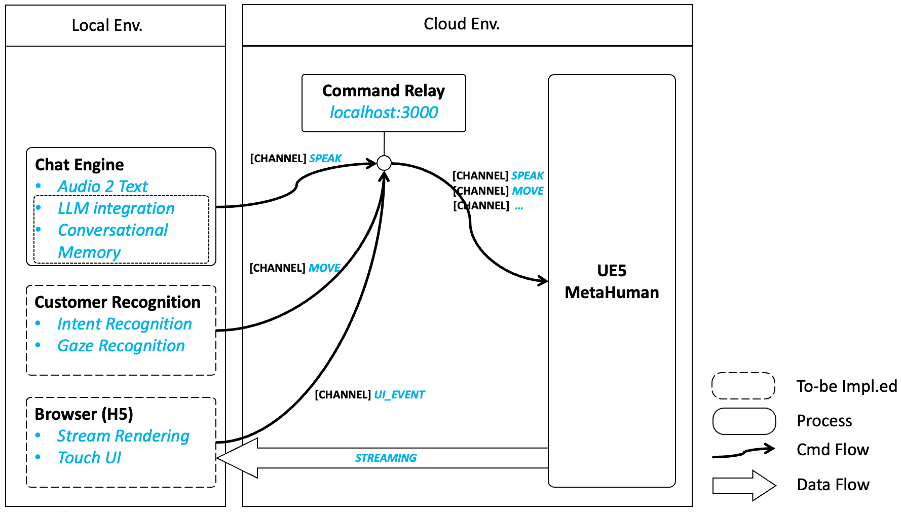

# Deployment View



# Installation Guide 

## Python Environment
### Install miniconda
- install miniconda and create a environment with python >= 3.8 and pip
```
> brew install miniconda

> conda create --name metahuman python=3.8 pip setuptools

> conda activate metahuman
```
### Install poetry
```
> pip install poetry
```
## Download dependencies
- under metahuman/RelayServer/
```
> poetry install
```

## Run

- Sign up your OpenAI developer account, generate a key and set it to your local environment:
  ```
    export OPENAI_API_KEY="your key string"
  ```

- Start the RelayServer first
   ```
   python relay_server.py
   ```

- Then start the audio client

   ```
   python audio_client.py
   ```

Whoala, just say something.

## TODOs
1. Noise control issue: The webrtcvad seems to have problems recognizing sound frames with human speech. It generates false possitive flags too often. So I set the sound frame shorter(5 seconds, maybe too short).
2. OpenAI Whisper API has quite slow. We need evaluate similar abilities from aws, azure or google. 
3. Move LLM related logic from audio_client.py to relay_server.py, and turn RelayServer into MetahumanServer. 